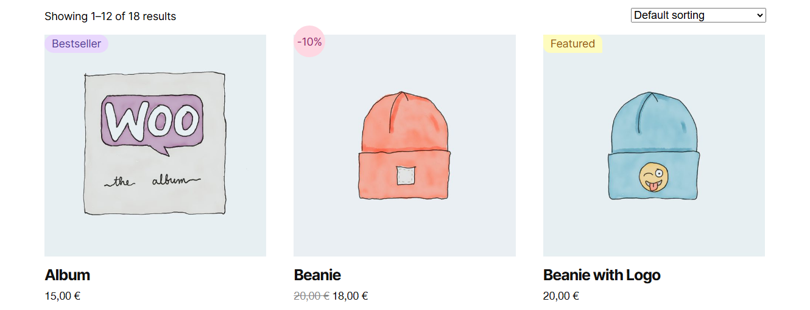
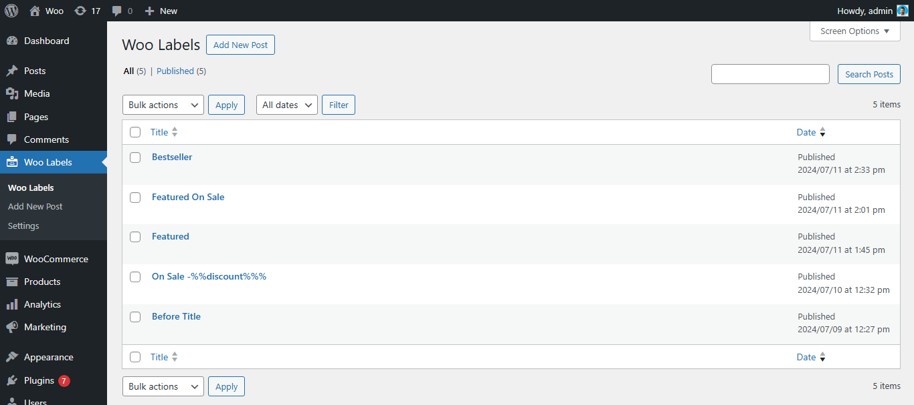
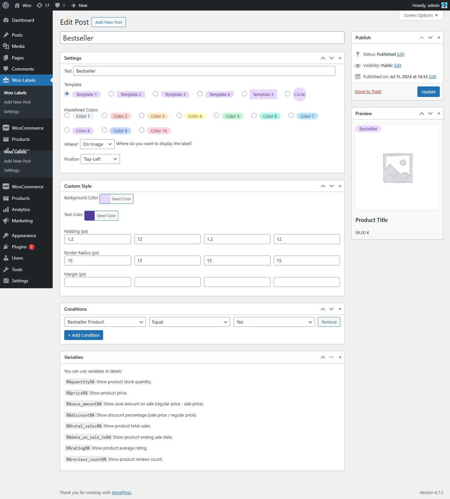

# RI Woo Labels

RI Woo Labels is a WordPress plugin that allows you to add custom labels to WooCommerce products. Labels are automatically displayed based on specific conditions set by the user.

## Features

- Add custom labels to WooCommerce products
- Automatic display based on configured conditions
- Supports the following conditions:
  - Featured
  - On Sale
  - Bestseller
  - Out of Stock
  - Category
- Fully customizable labels with custom styles

## Screenshots

## Installation

1. Download the code.
2. Upload the ZIP file via the WordPress admin panel (`Plugins > Add New > Upload Plugin`).
3. Activate the plugin.
4. Go to the Woo Labels section to configure labels and display conditions.

## Configuration

After activation, navigate to `Woo Labels > Woo Labels` to:
- Create new custom labels
- Assign labels to products based on desired conditions
- Customize the label design using CSS

## License

This project is released under the MIT license. See the `LICENSE` file for more details.

---

⭐ If you like this plugin, give the repository a star! ⭐

